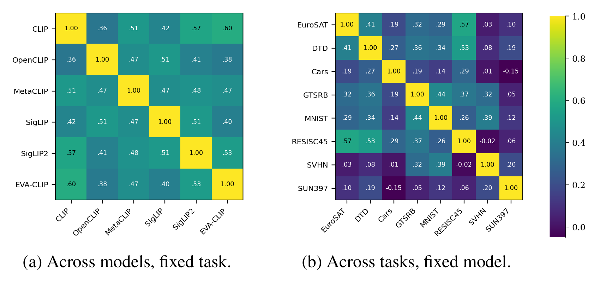

# Platonic Task Arithmetic

**[NeurIPS 2026]** Official PyTorch implementation of

> **Platonic Task Arithmetic**
>
> Junghwan Park,&ensp;Woojin Cho

### Abstract
*Distinct pre-trained models specialized for the same task converge to closely similar behavior, yet the parameter updates that produce it share no common coordinate system. Weight-space task arithmetic is therefore confined to a single model, and transporting an update between models requires a structural correspondence. Drawing on Plato's allegory of the cave, we hypothesize that these model-specific updates are shadows cast by one shared, model-agnostic object, which we call the platonic task vector. To make it operational across models of different architectures, we introduce Universal Task Descriptors, matrices whose shape is independent of architecture and embedding dimension, which record a task's functional effect and admit addition and negation as ordinary matrix operations. Transferring a descriptor into a target means editing the target until it reproduces the descriptor on the task's unlabeled probes and class-name prompts, with no per-input label. We realize that edit in two ways. A single least-squares solve returns an operator f ↦ (I + αA) folded into the target's last layer, and since the solution map is linear, a bank of operators, one per source and task, realizes any composition as a signed sum of its entries. Alternatively, a low-rank adapter of the target's encoder is trained on the same objective at the price of one optimization per edit. Heterogeneous models reflect the shared object through a model-specific residual comparable in norm to the shared component, yet transfer from another model retains 74 to 80 percent of the gain the target's own descriptors attain. Experiments across six model families, eight classification tasks and an audio instantiation show that task knowledge transfers and composes across heterogeneous models under both realizations.*

### Summary figure

<p align="center">

</p>

Pairwise cosine similarity between fine-tuning-induced descriptors, flattened to a common N × M shape. (a) Across models for a fixed task, a 6 × 6 matrix averaged over the eight tasks. (b) Across tasks for a fixed model, an 8 × 8 matrix averaged over the six families.

## Code

### Install dependencies

```bash
conda create -n pta python=3.10 -y
conda activate pta
pip install -r requirements.txt
pip install -e .
```

### Addition and negation

`addition.py` adds tasks from other models to a target, and `negation.py` removes a task from a target through another model's descriptor. Both edit the target in closed form by default, or with the adapter (`--method adapter`), and print its accuracy on the tasks and on CIFAR-100 before and after the edit:

```bash
# CLIP absorbs EuroSAT from OpenCLIP and DTD from MetaCLIP
python addition.py --target clip --terms openclip:eurosat,metaclip:dtd

# CLIP loses EuroSAT through OpenCLIP's descriptor
python negation.py --target clip --source openclip --task eurosat

# The same two edits realized by the adapter, one LoRA fitted per edit
python addition.py --target clip --terms openclip:eurosat,metaclip:dtd --method adapter
python negation.py --target clip --source openclip --task eurosat --method adapter
```

Models are `clip`, `openclip`, `metaclip`, `evaclip`, `siglip` and `siglip2`, and tasks are `eurosat`, `dtd`, `cars`, `gtsrb`, `mnist`, `resisc45`, `svhn` and `sun397`; models and datasets are downloaded on first use. `--help` lists the remaining options (strength, control sets, saving the edit).

The same addition in Python:

```python
from pta import models as M, transfer as TR

terms = [("openclip", "eurosat", 1.0), ("metaclip", "dtd", 1.0)]   # (source, task, coefficient)
bundle, feats = TR.prepare("clip", [(m, t) for m, t, _ in terms])
update = TR.closed_form_update("clip", terms, bundle, feats)
model, processor = M.load("clip")
TR.apply_closed_form(model, "clip", update, alpha=0.5)
```

The same addition with the adapter, which fits one LoRA to all terms jointly at full strength in place of the solve and the fold:

```python
model, processor = M.load("clip")
TR.fit_adapter(model, processor, "clip", terms, bundle, feats)
```

### Checkpoints

The 48 source fine-tunes that every descriptor is read from (six models × eight tasks, rank-4 LoRAs) are included in [checkpoints/sources](checkpoints/sources).

### License

The code is released under the MIT License. The checkpoints are LoRA adapters of third-party models and also follow the license of each base model (CC BY-NC 4.0 for MetaCLIP).
